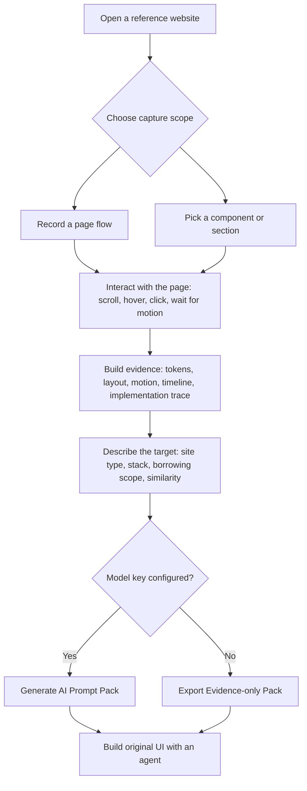

# Design Lens

> Turn impressive websites into AI-ready design reference packs: tokens, layout grammar, motion evidence, implementation routes, and focused coding prompts.

<p align="center">
  <a href="#install"></a>
  <a href="#install"></a>
  <a href="https://wxt.dev/"></a>
  <a href="#install"></a>
</p>

<p align="center">
  <a href="README.md">中文</a> / <strong>English</strong>
</p>

Design Lens is a browser extension for AI Coding / Vibe Coding workflows. It turns the website you are browsing into reusable design context: visual tokens, layout grammar, component structure, interaction timelines, motion evidence, implementation routes, and coding prompts that can be handed directly to an agent.

It is not a source-code cloning tool. It is an evidence-to-implementation layer for design reference. Whether you are new to building with AI or trying to make an agent understand sophisticated interaction, animation, and visual direction, Design Lens compresses “make it feel like this site” into structured, executable, reusable context.

## Install

The current version is installed through Chrome Developer Mode and is suitable for preview, evaluation, and extension development.

Requirements:

- Node.js `>=22.13.0`
- npm `>=10`
- Chrome or another Chromium browser

```bash
npm install
npm run build
```

Then open `chrome://extensions`, enable **Developer mode**, choose **Load unpacked**, and select:

```text
<project-root>/.output/chrome-mv3
```

After rebuilding, reload the extension from the same Chrome Extensions page.

## Product Preview

<table>
  <tr>
    <td width="33%" align="center">
      
    </td>
    <td width="33%" align="center">
      
    </td>
    <td width="33%" align="center">
      
    </td>
  </tr>
  <tr>
    <td><strong>🎛️ Capture-ready home</strong><br />Evidence health, core signals, current model, and the next action after recording.</td>
    <td><strong>🔐 Provider keys</strong><br />Save provider-specific OpenAI-compatible keys for OpenAI, DeepSeek, Moonshot, Qwen, and custom endpoints.</td>
    <td><strong>🧭 Build brief</strong><br />Choose the target site type, borrowing scope, stack, similarity level, and generate the prompt pack.</td>
  </tr>
</table>

## What It Solves

| Scenario | Common problem | Design Lens provides |
| --- | --- | --- |
| Building homepages, portfolios, campaign pages, or SaaS sites with AI | Screenshots miss timing, states, rhythm, and implementation boundaries. | A structured read of tokens, layout, components, timelines, interactions, and implementation guidance. |
| Users who are not prompt-writing specialists | Advanced UI, cursor effects, scroll motion, and technical choices are hard to describe. | A prompt pack generated from the target site type and captured evidence. |
| Frontend and design engineers | Agents need repeated explanations of colors, spacing, hover, scroll, library choices, and acceptance rules. | Reusable Skill and evidence files that become project context. |
| Senior builders dissecting references | Manual inspection, recording, screenshots, and implementation mapping take time. | A compressed evidence layer for faster review, adaptation, and agent handoff. |

## Feature Highlights

| Capability | What Design Lens captures | Why it matters |
| --- | --- | --- |
| 🎥 Manual recording | Scroll, hover, pointer movement, animation timing, DOM mutation, visual-surface hints, and performance signals. | Captures real state changes instead of flattening a reference into one screenshot. |
| 🧱 Component picking | Hero, card, gallery, CTA, navigation, pricing block, media module, or large page section references. | Produces module-focused Skills that are easier to reuse in original projects. |
| 🎨 Design tokens | Color, typography, spacing, radius, density, alignment, layout cadence, and responsive structure. | Gives agents concrete design grammar instead of subjective adjectives. |
| ⏱️ Interaction timeline | Pointer samples, scroll samples, runtime animations, reveal order, state changes, and repeated motion patterns. | Turns “premium interaction” into implementable and testable sequences. |
| 🧬 Implementation trace | Framework/library/resource/event/style-runtime clues, plus animation and media implementation routes. | Recommends GSAP, Framer Motion, Lenis, Rive, Three.js, Canvas/WebGL, CSS masks, or lighter CSS routes when appropriate. |
| ✍️ AI prompt | Combines the user's goal, compressed evidence, borrowing boundaries, and output rules. | Produces a coding prompt tied to the actual product goal instead of a generic website summary. |

## Output Packs

| Pack | Files | Use it when |
| --- | --- | --- |
| ✨ AI Prompt Pack | `README.md`, `skill.md`, `evidence.json`, `ai-coding-prompt.md`, `ai-implementation-brief.md` | You configured a model key and want an immediately usable coding prompt plus evidence. |
| 🗂️ Evidence-only Pack | `README.md`, `skill.md`, `evidence.json` | You want to save/share the reference now or use your own AI tool later. |

Fast path with AI: give your coding agent `ai-coding-prompt.md`, `skill.md`, and `evidence.json`, then add one sentence such as “build this as an original SaaS homepage for my product.”

Fast path without AI: give your agent `skill.md` and `evidence.json`, then describe the target site in plain language.

## Workflow



## Usage

1. Open a normal `http` or `https` webpage.
2. Click the Design Lens extension icon.
3. Choose **Record page** for a full flow, or **Pick component** for a specific module.
4. Scroll, hover, click, and wait through key animation states.
5. Configure an OpenAI-compatible provider key only if you want AI prompt generation.
6. Fill the build brief: site type, goal, borrow scope, stack, output type, and similarity level.
7. Generate an **AI Prompt Pack**, or export an **Evidence-only Pack**.
8. Hand the files to your coding agent and build an original interface.

## Development

```bash
npm run dev
```

Production build and ZIP:

```bash
npm run build
npm run zip
```

Quality gate:

```bash
npm run check
```

## Project Structure

```text
entrypoints/        WXT extension entrypoints
  background.ts     Toolbar action and command wiring
  content.ts        Page content bridge
  popup/            React popup UI, pack builder, and popup-specific components
src/analyzer/       Capture and analysis engine
  capture/          Page capture, element picker, interaction and motion detectors
  core/             Shared DOM utilities, tokenization, and design analysis
  layout/           Component detection and layout profiling
  timeline/         Recording timeline, runtime signals, and pattern analysis
src/ai/             Prompt compiler and optional OpenAI-compatible client
src/evidence/       Shared evidence pack and replay-style summary
src/generators/     Export and Skill generators
  export/           Prototype-oriented export helpers
  skill/            Page/component Skill writers and formatting rules
src/overlay/        In-page recorder and picker overlay
src/shared/         Schemas, locale, theme, and AI settings
docs/               Architecture, privacy, research, and assets
```

## Trust And Privacy

Design Lens captures reference evidence inside the browser extension. Optional AI generation only sends a reduced evidence payload designed to exclude raw DOM, cookies, local storage, and credentials.

Saved provider keys are stored per provider profile in browser local storage and can be cleared by the user.

## Documentation

- [Privacy](docs/privacy.md)
- [Architecture](docs/architecture.md)
- [Implementation Trace](docs/implementation-trace.md)
- [Validation](docs/validation.md)

## Thanks

- [VisBug](https://github.com/GoogleChromeLabs/ProjectVisBug) for browser-native selection and inspection ergonomics.
- [rrweb](https://github.com/rrweb-io/rrweb) for replayable event streams and timeline evidence.
- [Spector.js](https://github.com/BabylonJS/Spector.js) for visual-surface and WebGL inspection concepts.
- [Chrome DevTools Protocol](https://chromedevtools.github.io/devtools-protocol/) for animation, CSS, DOMSnapshot, and runtime-inspection direction.
- [WXT](https://wxt.dev/) for the browser extension framework.
