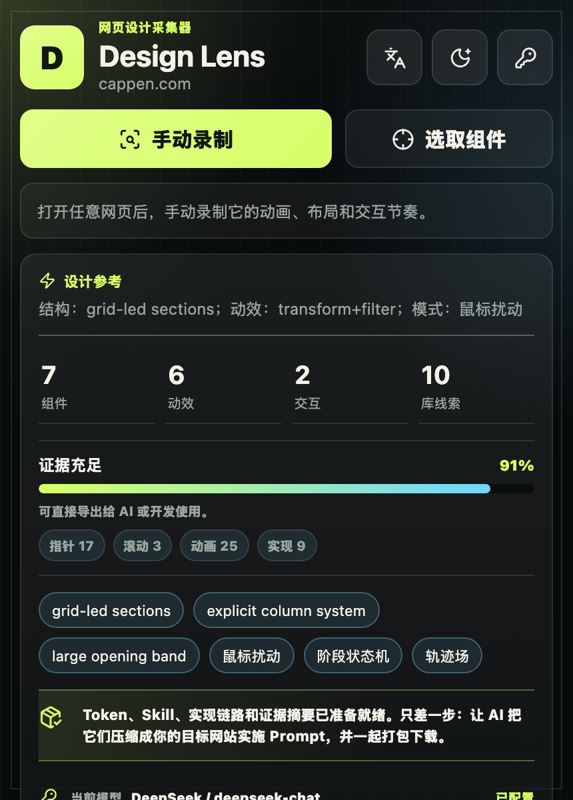
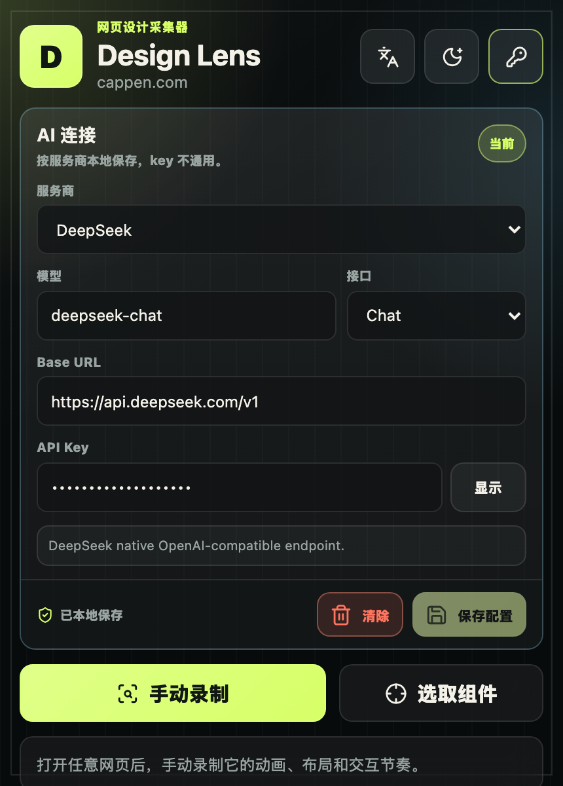
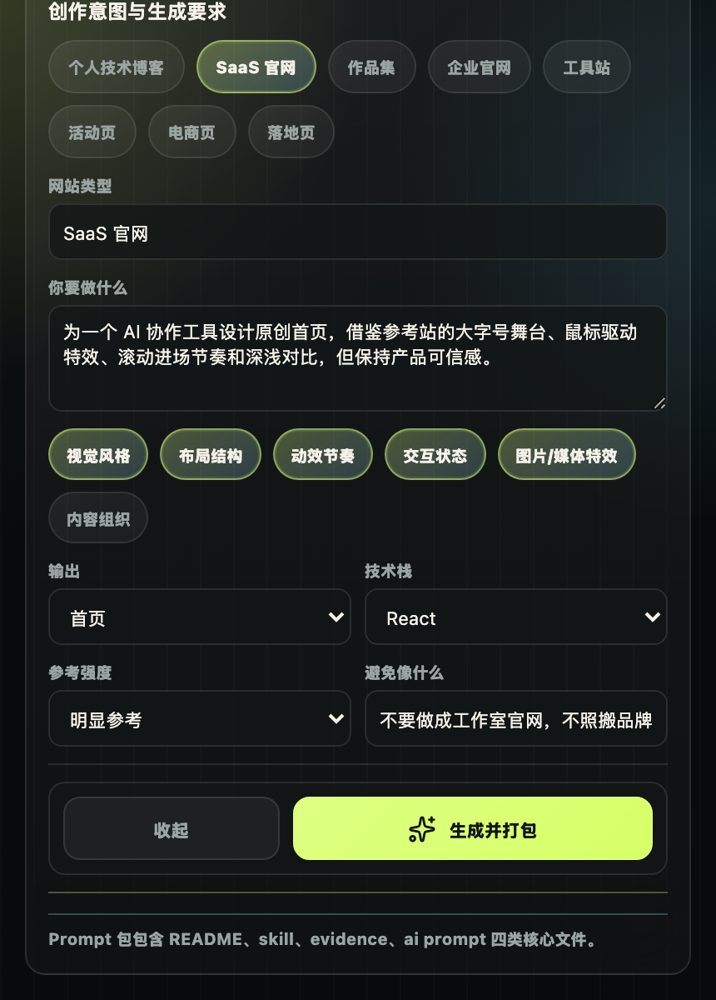
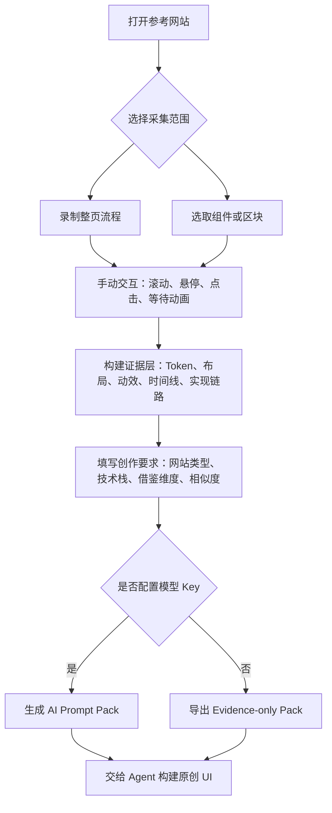

# Design Lens

> 把优秀网页转成 AI 可用的设计参考包：Token、布局语法、动效证据、实现路线和高含金量编码 Prompt。

<p align="center">
  <a href="#安装"></a>
  <a href="#安装"></a>
  <a href="https://wxt.dev/"></a>
  <a href="#安装"></a>
</p>

<p align="center">
  <strong>中文</strong> / <a href="README.en.md">English</a>
</p>

Design Lens 是一个面向 AI Coding / Vibe Coding 的浏览器扩展。它把正在浏览的优秀网页，转译成可复用的设计参考包：视觉 Token、布局语法、组件结构、交互时间线、动效证据、实现路线，以及可直接交给 Agent 的编码 Prompt。

它不是源码克隆工具，而是“证据到实现”的设计转译层。无论你是刚开始用 AI 做网站，还是想让 Agent 更准确地理解高级交互、复杂动画和视觉风格，Design Lens 都能把模糊的“参考这个网站”压缩成结构化、可执行、可复用的工程上下文。

## 安装

当前版本通过 Chrome 开发者模式安装，适合预览、试用和二次开发。

环境要求：

- Node.js `>=22.13.0`
- npm `>=10`
- Chrome 或其他 Chromium 浏览器

```bash
npm install
npm run build
```

然后打开 `chrome://extensions`，开启 **开发者模式**，点击 **加载已解压的扩展程序**，选择：

```text
<project-root>/.output/chrome-mv3
```

重新构建后，在同一页面点击扩展的重新加载按钮即可。

## 界面预览

<table>
  <tr>
    <td width="33%" align="center">
      
    </td>
    <td width="33%" align="center">
      
    </td>
    <td width="33%" align="center">
      
    </td>
  </tr>
  <tr>
    <td><strong>🎛️ 捕获完成首页</strong><br />证据强度、核心信号、当前模型和下一步操作集中在一个主链路里。</td>
    <td><strong>🔐 模型 Key 配置</strong><br />按服务商保存 OpenAI 兼容模型 Key，支持 OpenAI、DeepSeek、Moonshot、Qwen 和自定义端点。</td>
    <td><strong>🧭 定制生成要求</strong><br />选择网站类型、借鉴维度、技术栈和相似度，然后生成并下载 Prompt 资料包。</td>
  </tr>
</table>

## 它解决什么

| 使用场景 | 常见问题 | Design Lens 提供 |
| --- | --- | --- |
| AI 做首页、作品集、活动页或 SaaS 官网 | 截图只能表达表面，动效、状态、节奏和实现边界容易丢失。 | 把参考站拆成 Token、布局、组件、时间线、交互和实现建议。 |
| 不擅长写 Prompt 的用户 | 不知道怎么描述高级 UI、鼠标特效、滚动动画和技术选型。 | 只需要补充目标网站类型，插件会组织可直接交给 AI 的 Prompt Pack。 |
| 前端工程师和设计工程师 | 需要反复向 Agent 解释颜色、间距、hover、滚动、库选型和验收标准。 | 输出可复用 Skill 与 evidence，作为项目上下文和实现对照表。 |
| 资深开发者做参考拆解 | 手动观察、录屏、截图、归纳实现路线成本高。 | 提供压缩后的证据层，用于快速审查、改造和交给 Agent 执行。 |

## 功能亮点

| 能力 | 采集内容 | 价值 |
| --- | --- | --- |
| 🎥 手动录制 | 滚动、悬停、鼠标轨迹、动画时序、DOM 变化、视觉表面线索和性能信号。 | 捕获真正发生在页面里的状态变化，而不只是一张静态截图。 |
| 🧱 组件选取 | Hero、卡片、画廊、CTA、导航、价格区、媒体模块或大区块。 | 针对单个组件生成参考 Skill，适合复用到自己的页面模块里。 |
| 🎨 设计 Token | 色彩、字体、间距、圆角、密度、对齐、布局节奏和响应式结构。 | 让 Agent 拿到具体设计语法，而不是“高级”“科技感”这类空泛形容词。 |
| ⏱️ 交互时间线 | 指针样本、滚动样本、运行时动画、进场顺序、状态变化和重复动效模式。 | 把“丝滑交互”拆成可以实现、可以验收的阶段序列。 |
| 🧬 实现链路 | 框架、库、资源、事件模型、运行时样式和动画/媒体实现路线线索。 | 按场景建议 GSAP、Framer Motion、Lenis、Rive、Three.js、Canvas/WebGL、CSS mask 或轻量 CSS 路线。 |
| ✍️ AI Prompt | 合并用户目标、压缩证据、借鉴边界和输出格式。 | 生成围绕目标产品展开的编码 Prompt，而不是通用化的网站分析。 |

## 产出物

| 资料包 | 文件 | 适合场景 |
| --- | --- | --- |
| ✨ AI Prompt Pack | `README.md`、`skill.md`、`evidence.json`、`ai-coding-prompt.md`、`ai-implementation-brief.md` | 已配置模型 Key，希望立刻拿到可用编码 Prompt 和完整证据。 |
| 🗂️ Evidence-only Pack | `README.md`、`skill.md`、`evidence.json` | 不配置 AI，先保存或分享参考证据，之后交给自己的 AI 工具。 |

最快用法：如果有 AI Prompt Pack，把 `ai-coding-prompt.md`、`skill.md`、`evidence.json` 一起交给 AI Coding Agent，再补一句“为我的 SaaS 产品做原创首页”即可。

如果只有 Evidence-only Pack，把 `skill.md` 和 `evidence.json` 给 AI，然后用自然语言说明你要做的网站类型和目标。

## 工作流



## 使用方式

1. 打开普通 `http` 或 `https` 网页。
2. 点击 Design Lens 插件图标。
3. 选择 **手动录制** 捕捉整页流程，或选择 **选取组件** 捕捉某个模块。
4. 录制时主动滚动、悬停、点击，并等待关键动画状态出现。
5. 如果需要插件直接生成 Prompt，再配置 OpenAI 兼容模型 Key。
6. 填写创作要求：网站类型、目标、借鉴维度、技术栈、输出类型和相似度。
7. 生成 **AI Prompt Pack**；不配置 AI 时导出 **Evidence-only Pack**。
8. 把资料包交给 AI Coding Agent，用来构建原创网站或组件。

## 本地开发

```bash
npm run dev
```

生产构建和打包：

```bash
npm run build
npm run zip
```

质量检查：

```bash
npm run check
```

## 项目结构

```text
entrypoints/        WXT 扩展入口
  background.ts     工具栏和命令连接
  content.ts        页面内容脚本桥接
  popup/            React 插件弹窗 UI、资料包构建与弹窗组件
src/analyzer/       采集与分析引擎
  capture/          页面采集、组件选取、交互和动效探测
  core/             DOM 工具、Token 提取与设计分析
  layout/           组件识别与布局画像
  timeline/         录制时间线、运行时信号和模式分析
src/ai/             提示词编译与 OpenAI 兼容客户端
src/evidence/       共享证据包与回放式摘要
src/generators/     导出与 Skill 生成
  export/           原型导出相关辅助
  skill/            页面/组件 Skill 生成与格式化规则
src/overlay/        页面内录制与选取层
src/shared/         Schema、语言、主题和 AI 设置
docs/               架构、隐私、调研和截图资产
```

## 信任与隐私

Design Lens 在浏览器插件内采集参考证据。可选 AI 生成只会发送压缩后的证据载荷，设计上会排除原始 DOM、Cookie、本地存储和凭证。

保存的模型服务商 Key 会按供应商配置存储在浏览器本地，并可由用户清除。

## 相关文档

- [隐私说明](docs/privacy.md)
- [架构说明](docs/architecture.md)
- [实现链路](docs/implementation-trace.md)
- [验证记录](docs/validation.md)

## 鸣谢

- [VisBug](https://github.com/GoogleChromeLabs/ProjectVisBug)：浏览器内选择和检查体验。
- [rrweb](https://github.com/rrweb-io/rrweb)：可回放事件流和时间线证据。
- [Spector.js](https://github.com/BabylonJS/Spector.js)：视觉表面与 WebGL 检查思路。
- [Chrome DevTools Protocol](https://chromedevtools.github.io/devtools-protocol/)：动画、CSS、DOMSnapshot 和运行时检查方向。
- [WXT](https://wxt.dev/)：浏览器扩展开发框架。
