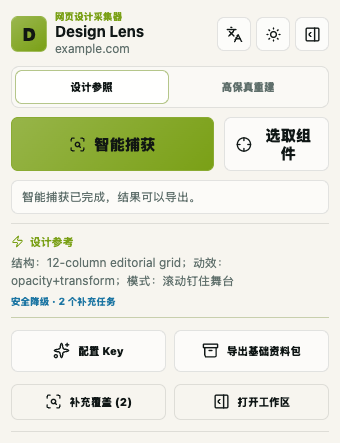
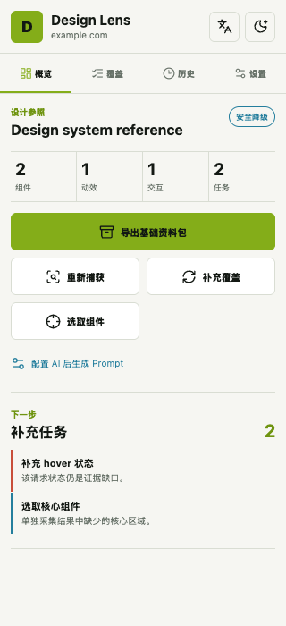
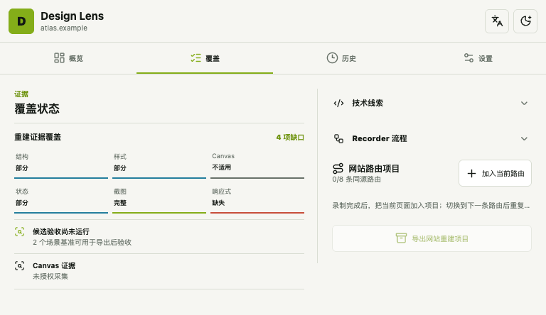
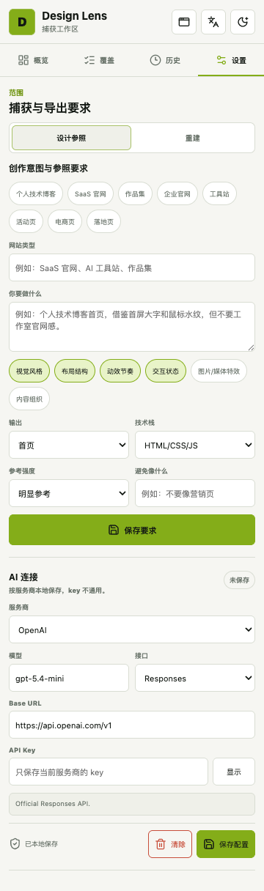
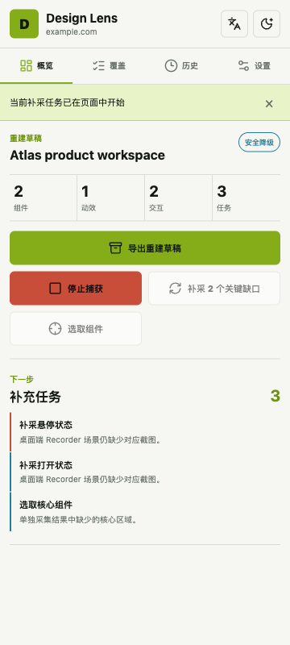
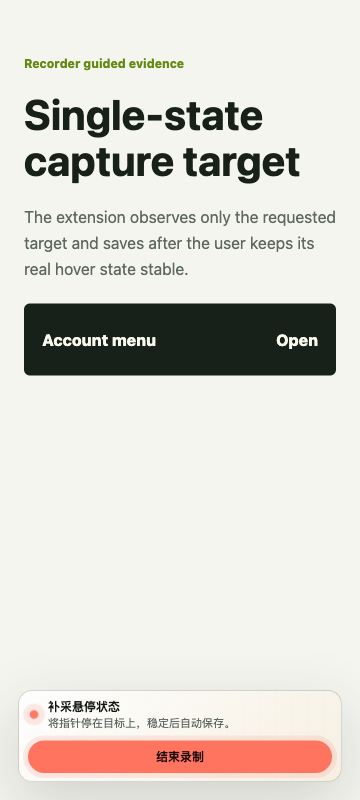
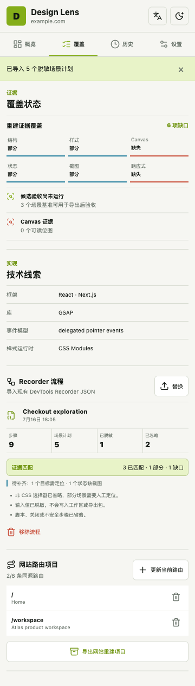

# Design Lens

> 把“参考这个网站”变成可追溯、可执行、可验收的 AI 前端上下文。

[](https://github.com/isla4ever/design-lens/actions/workflows/ci.yml)


[](LICENSE)

**中文** | [English](README.en.md)

Design Lens 是一个 **evidence-first（证据优先）** 的 Chrome 扩展，面向 AI Coding、Vibe Coding 和前端设计还原工作流。它不只截一张图或总结页面，而是把真实网页转译为视觉 Token、布局结构、组件语法、交互时间线、动效证据、实现线索和验收规则。

```text
真实网页 → 智能捕获 → 结构化证据 → 明确缺口 → Prompt / Rebuild 草稿 → 场景验收
```

它不是源码下载器，也不会把缺失状态猜成“完整复刻”。Design Lens 的原则是：**有证据才描述，没有证据就明确标记缺口。**

> [!IMPORTANT]
> 当前版本处于 alpha 阶段，仅通过 Chrome 开发者模式安装。请只在你有权分析、参考或重建的页面上使用。

## 项目亮点

| 亮点 | Design Lens 的做法 |
| --- | --- |
| **一次操作完成基础捕获** | 默认只需点击“智能捕获”。前置索引、稳定快照和被动观察共享 15 秒预算；Rebuild 的分段截图与 CDP 整理由独立超时和熔断保护，持续变动或超大页面会安全降级。 |
| **默认打开完整侧边栏** | 点击扩展图标直接进入 Side Panel；模式、捕获、覆盖、历史和设置集中在同一工作区。需要快速操作时，可从侧边栏打开锚定工具栏的原生插件弹窗，不再创建独立页面窗口。 |
| **Reference 与 Rebuild 双模式** | Reference 提炼可迁移的设计语言；Rebuild 保存真实截图、场景、几何与验收约束。用户根据目标选择，不把“借鉴”和“复刻”混为一谈。 |
| **只补真正缺失的状态** | 自动评估证据健康度，只生成最多 3 个滚动、悬停、焦点、展开或响应式补采任务，不要求用户从头手动录制整页。 |
| **从捕获直接走到验收** | Rebuild Pack 自带场景清单和验收规则，可对候选实现执行截图、像素、几何、动画进度和浏览器错误检查。 |
| **不代替用户操作页面** | 不自动点击、输入、提交表单或跳转未知页面。补采任务由用户完成真实操作，插件只观察目标状态并保存证据。 |
| **按需注入、权限分层** | 页面桥接只在用户发起操作后注入；标准版不包含 `debugger`，深度 CDP 采集隔离在单独的 Collector 构建。 |

## 不只是截图转 Prompt

| 维度 | 常见截图式流程 | Design Lens |
| --- | --- | --- |
| 输入 | 单张或少量静态截图 | DOM 结构、Token、几何、截图、事件、动效和运行时线索 |
| 交互状态 | 依赖人工描述或模型猜测 | 真实 hover、focus、scroll、open 和响应式场景证据 |
| 缺失信息 | 经常被模型补全成想象结果 | 明确记录为 `missing`、`partial` 或 `not-applicable` |
| 输出 | 一段通用 Prompt | Evidence Pack、AI Prompt Pack、Rebuild Draft Pack |
| 验收 | 靠肉眼判断“像不像” | 基于已捕获场景的可解释候选验证报告 |

## 产品预览

### 1. 智能捕获与 Reference 工作区

<table>
  <tr>
    <td width="46%" align="center">
      
    </td>
    <td width="54%" align="center">
      
    </td>
  </tr>
  <tr>
    <td><strong>插件弹窗</strong><br />只保留模式、智能捕获、组件选取、手动补采与导出，详细要求统一放在 Side Panel。</td>
    <td><strong>Reference 工作区</strong><br />集中查看证据、导出入口和自动生成的补充任务，避免重复操作。</td>
  </tr>
</table>

### 2. Rebuild 覆盖与多路由项目

<p align="center">
  
</p>

Rebuild 不用一个“完成度百分比”掩盖问题。结构、样式、状态、截图、响应式和 Canvas 分开显示；技术线索与 Recorder 默认折叠，只有需要时才展开。同源页面可加入最多 8 条路由并分别验收。

<details>
  <summary><strong>查看 Side Panel 配置界面</strong></summary>
  <br />
  <p align="center">
    
  </p>
</details>

### 3. 引导式补采：用户操作，插件观察

<table>
  <tr>
    <td width="50%" align="center">
      
    </td>
    <td width="50%" align="center">
      
    </td>
  </tr>
  <tr>
    <td><strong>只下发一个清晰任务</strong><br />Side Panel 说明当前缺口和下一步动作。</td>
    <td><strong>只观察目标状态</strong><br />用户完成真实悬停、滚动或展开后自动保存，不执行合成点击。</td>
  </tr>
</table>

<details>
  <summary><strong>查看 Recorder 导入与证据匹配</strong></summary>
  <br />
  <p align="center">
    
  </p>
  <p>可导入脱敏后的 Chrome DevTools Recorder JSON。Design Lens 不自动重放流程，而是把步骤映射到已有截图证据，并把未闭环场景归并为最多三个补采任务。</p>
</details>

## 两种工作模式

| 模式 | 适用目标 | 输出边界 |
| --- | --- | --- |
| **设计参照（Reference）** | 从优秀页面借鉴视觉、布局、动效或交互，构建原创界面 | 提取可迁移的设计语法，不把参考站点的品牌、内容和素材当成目标产品 |
| **高保真重建（Rebuild）** | 在明确授权下建立可验证的实现草稿 | 只对已有截图和场景证据负责；未捕获状态始终作为缺口，不宣称已经高保真 |

## 工作流程

1. **打开页面**：进入普通 `http` 或 `https` 页面，点击 Design Lens，默认打开 Side Panel。
2. **选择目标**：Reference 用于原创设计参照；Rebuild 用于授权范围内的实现草稿。
3. **智能捕获**：自动完成基础证据采集，页面桥接只在此类用户操作后按需注入。
4. **检查缺口**：在 Side Panel 查看覆盖状态，只对关键缺口执行引导补采。
5. **整理项目**：可导入 Recorder 计划，或将最多 8 条同源路由加入 Rebuild 项目。
6. **导出与构建**：把证据包或 Prompt Pack 交给 AI Coding Agent。
7. **候选验收**：使用 Rebuild 验证器检查已有场景，不推测未捕获行为。

## 输出资料包

| 资料包 | 主要文件 | 用途 |
| --- | --- | --- |
| **Evidence-only Pack** | `README.md`、`skill.md`、`evidence.json` | 保存、分享或交给任意 AI 工具的结构化设计证据 |
| **AI Prompt Pack** | Evidence 文件、`ai-coding-prompt.md`、`ai-implementation-brief.md` | 使用 OpenAI 兼容模型生成面向目标项目的编码 Prompt |
| **Rebuild Draft Pack** | `capture-project-v2.json`、`scene-manifest.json`、`acceptance.json`、截图与受限 artifact | 保存授权重建基线、显式缺口和候选实现验收规则 |

## 安装

环境要求：Node.js `>=22.13.0`、npm `>=10`、Chrome 或其他 Chromium 浏览器。

### 标准版

```bash
npm ci
npm run build
```

打开 `chrome://extensions`，开启 **开发者模式**，点击 **加载已解压的扩展程序**，选择：

```text
<project-root>/.output/chrome-mv3
```

标准版不申请 Chrome `debugger` 权限，适合日常 Reference 和基础 Rebuild 捕获。

### Collector 版

```bash
npm run build:collector
```

加载 `<project-root>/.output/collector/chrome-mv3`。Collector 会额外申请 `debugger`，用于经授权的 DOMSnapshot、matched CSS、几何、视口和动画证据。Canvas 位图默认关闭，并受数量、像素和文件大小预算限制。

## Rebuild 候选验收

```bash
npm run verify:rebuild -- \
  --pack <rebuild-pack.zip> \
  --url http://localhost:3000
```

验证器只重放 `scene-manifest.json` 中已有证据的 initial、scroll、hover、focus 和 open 状态。输出包括 JSON/HTML 报告、候选截图、差异图和供 Agent 局部修复使用的上下文。

真实长页的捕获、候选实现和误差数据见 [AstroWind 自动重建实战](docs/astrowind-rebuild-benchmark.md) 与 [Bilibili 首页智能捕获与重建实战](docs/bilibili-rebuild-benchmark.md)。两个案例都保留失败项，并据此给出下一阶段优先级；Bilibili 案例还覆盖了高 mutation 页面下的恢复性与稳定节点验收。

## 隐私与权限

Design Lens 默认在本地处理和导出证据。只有用户配置模型 Key 并主动生成 AI 输出时，插件才发送压缩后的证据载荷；该载荷设计上排除原始 DOM、Cookie、本地存储、凭证、截图和未脱敏输入值。

| 权限 | 用途 |
| --- | --- |
| `activeTab`、`scripting` | 用户发起操作后，向当前页面按需注入桥接并执行采集 |
| `storage` | 在浏览器本地保存语言、主题、工作区元数据和可选 AI 配置 |
| `tabs`、`sidePanel` | 识别当前标签页并连接持久工作区 |
| `<all_urls>` | 允许用户在不同站点上发起捕获；不代表扩展会自动在所有页面运行 |
| `debugger` | 仅 Collector 构建包含，用于明确授权后的受限深度采集 |

本地 Rebuild 包可能包含页面可见文本、截图和脱敏后的 DOMSnapshot，应按敏感文件处理。完整边界见 [隐私与权限说明](docs/privacy.md)。

## 开发与质量门禁

```bash
npm run dev                 # 标准版开发服务器
npm run dev:collector       # Collector 开发服务器
npm run check:all           # TypeScript、90 项测试和两种生产构建
npm run check:browser       # 真实 MV3 注入、UI 对齐/溢出、20k/100k DOM 性能与恢复探针
npm run package:release     # 校验权限/版本并生成 ZIP 与 SHA256SUMS
```

浏览器门禁首次运行前执行：

```bash
npx playwright install chromium
```

## 项目结构

```text
entrypoints/        WXT background、content、popup 与 side panel 入口
src/analyzer/       页面结构、Token、交互与动效分析
src/capture-v2/     Rebuild 项目、CDP Collector、场景与验收契约
src/evidence/       证据包与摘要
src/generators/     Evidence、Prompt 与 Skill 生成器
src/overlay/        页面内选取和引导补采控制器
src/smart-capture/  智能捕获预算、编排和缺口任务
src/storage/        IndexedDB 工作区与 artifact 存储
scripts/            发布、压力探针和 Rebuild 验证工具
tests/              行为测试
docs/               架构、隐私、产品决策和验证记录
```

## 文档与贡献

- [架构说明](docs/architecture.md)
- [隐私与权限](docs/privacy.md)
- [验证记录](docs/validation.md)
- [AstroWind 自动重建实战](docs/astrowind-rebuild-benchmark.md)
- [Bilibili 首页智能捕获与重建实战](docs/bilibili-rebuild-benchmark.md)
- [变更记录](CHANGELOG.md)
- [参与贡献](CONTRIBUTING.md)
- [安全策略](SECURITY.md)
- [发布检查清单](docs/release-checklist.md)

提交较大功能前请先创建 Issue。安全问题请通过 [GitHub Private Vulnerability Reporting](https://github.com/isla4ever/design-lens/security/advisories/new) 私下报告。

## License

[MIT](LICENSE) © Isla
