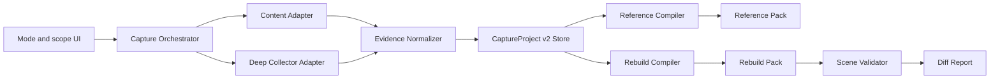

# Design Lens 双模式产品与工程实施方案

> 状态：实施中，P0、P1、P2、P3、P4、P4c、P5a、P5b1、P5c、P5d、P5e 与 P5f 已完成
> 调研日期：2026-07-13
> 目标：同时支持“设计参照”和“高保真重建”，并让用户在采集前明确选择任务。

当前进度：

- P0 已完成：`CaptureProject v2`、v1 兼容适配、无损资料包、IndexedDB artifact store、二进制压缩 ZIP。
- P1 已完成：Reference/Rebuild 双模式、旧相似度迁移、模式专用表单、Rebuild draft、授权门槛和覆盖缺口。
- P2 已完成：脱敏 rrweb 原始事件、录制起点截图、当前视口整页分段 PNG、滚动恢复、二进制 Rebuild Pack 和真实覆盖状态。
- P3a 已完成：独立 Collector 生产构建、可靠 debugger 生命周期、脱敏 DOMSnapshot、matched CSS、几何和当前动画证据。
- P3b1 已完成：录制前范围/授权、多视口 initial 基线、安全 `hover/focus` 伪状态、观察式 open 和完整恢复。
- P3b2 已完成：多视口 scroll scene、短页面 not-applicable、录制行为驱动的多目标 hover/focus 和滚动恢复。
- P4a 已完成：scene manifest Playwright 重放、pixelmatch、动态遮罩、几何 diff、HTML/JSON 报告和局部修复上下文。
- P4b 已完成：有限 CSS/WAAPI 动画 25%/50%/75% reference checkpoint、候选逐帧 seek/diff、播放状态恢复和独立 motion 统计。
- P5a 已完成：显式授权的受限 Canvas 位图证据、可读性状态、artifact 上限、Canvas 验收和覆盖 UI。
- P5b1 已完成：同源多路由项目、显式逐页加入、路由级证据隔离、聚合 ZIP 和 `--route` 验收。
- P4c 已完成：Chrome DevTools Recorder/Puppeteer schema 脱敏导入、场景计划编译、IndexedDB 持久化、Rebuild ZIP 导出和 Side Panel 导入 UI。
- P5c 已完成：Recorder 场景与现有截图证据按 URL、视口、状态、滚动位置和 selector 自动对齐，区分 matched/partial/missing 并写入验收清单。
- P5d 已完成：Recorder partial/missing 场景自动归并为最多三个补采任务，优先缺失截图并复用现有引导采集与组件选取流程。
- P5e 已完成：Recorder match 随捕获原子重算、同路由流程继承、缺失 selector 的用户确认定位，以及真实截图出现后的任务自动收敛。
- P5f 已完成：单任务页面引导、用户真实状态的定向截图、稳定后自动停止，以及 observed/forced 状态来源区分。
- 后续延后：Spector.js WebGL frame 和跨路由用户流程自动编排。

## 1. 最终产品决策

Design Lens 不再把“气质启发、明显参考、高保真结构”视为同一条相似度刻度。
它们背后是两种不同任务，应共用采集基础设施，但必须使用不同的采集深度、用户输入、
输出资料包和验收标准。

| 模式 | 用户目标 | 产品承诺 | 核心输出 |
| --- | --- | --- | --- |
| Reference / 设计参照 | 从参考站提取设计语言，构建原创产品 | 减少描述成本和风格偏移，不承诺像素一致 | 设计 Skill、Token、模式库、原创实施 Brief、编码 Prompt |
| Rebuild / 高保真重建 | 在有权使用的范围内重建指定页面、组件或流程 | 对已定义的场景矩阵进行可测量还原，不承诺复制所有不可观察实现 | 场景截图、完整结构和样式证据、状态图、重建任务、验收基线 |

高保真不是“更长的 Prompt”，而是“更完整的证据 + 可重复的场景 + 自动验收”。

## 2. 产品评审

### 2.1 用户意图

- Reference 用户想借鉴视觉、布局、动效或内容组织，但仍然构建原创产品。
- Rebuild 用户想减少人工检查，获得足够细的结构、样式和状态证据，并验证重建结果。
- 两类用户都不应该理解 DOM、CDP、CSS rule coverage 等内部技术概念。

### 2.2 当前问题

- [`src/shared/design-brief.ts`](../src/shared/design-brief.ts) 将高保真作为 `similarity` 值，混淆了任务类型和参考强度。
- [`src/analyzer/core/dom-utils.ts`](../src/analyzer/core/dom-utils.ts) 的可见性判断只覆盖当前视口。
- [`src/analyzer/capture/capture-page.ts`](../src/analyzer/capture/capture-page.ts) 对元素、布局、组件、动效和交互都有数量截断。
- [`src/ai/context.ts`](../src/ai/context.ts) 在构建 AI 上下文时再次裁剪证据。
- [`entrypoints/popup/pack-builder.ts`](../entrypoints/popup/pack-builder.ts) 没有将完整的布局、组件、动效、交互和时间线写入 `evidence.json`。
- [`src/generators/export/prototype.ts`](../src/generators/export/prototype.ts) 会主动生成通用渐变、卡片和 hover，更适合 Reference 演示，不能作为 Rebuild 基线。

### 2.3 推荐边界

第一版 Rebuild 只承诺：

- 单页面或单组件。
- 明确选择的桌面和移动视口。
- 初始、滚动锚点、hover、focus、菜单/弹层等有限状态。
- HTML/CSS/SVG/普通图片和视频表面的可观察结果。
- 基于截图、几何和状态覆盖的验收。

第一版暂缓：

- 自动遍历完整多页面站点。
- 需要真实支付、提交或破坏性操作的流程。
- 跨域 iframe 内部的无授权采集。
- 闭合 Shadow DOM、DRM 媒体和服务端私有状态。
- 任意 WebGL shader、粒子系统或随机动画的完全等价重建。
- 下载或再发布没有明确授权的品牌资产、字体、图片和视频。

## 3. 用户体验设计

### 3.1 首要选择

插件首屏使用分段控制：

1. `提取设计参考`
2. `高保真重建`

模式必须在采集前确定，因为 Rebuild 需要截图、场景状态和更高的数据容量。
Reference 结果页可以提供“升级为高保真采集”，升级动作会保留已有证据并提示补录，
不能只切换标记后沿用不完整数据。

### 3.2 Reference 流程

```text
选择 Reference
-> 选择整页或组件
-> 快速扫描或手动录制
-> 填写目标产品、借鉴维度、避免项和技术栈
-> 查看证据覆盖
-> 导出 Reference Pack
```

Reference 中保留 `inspired` 和 `strong-reference`，但它们只影响设计迁移强度，
不改变事实采集协议。

### 3.3 Rebuild 流程

```text
选择 Rebuild
-> 确认拥有重建和资产使用权限
-> 选择页面、组件或交互流程
-> 选择视口和需要的状态
-> 执行自动采集并补充手动交互
-> 查看场景覆盖矩阵
-> 导出 Rebuild Pack
-> 输入目标实现地址
-> 运行同场景截图和差异验收
```

用户只配置任务范围，不配置底层协议。CSS、DOMSnapshot、截图参数、事件采样和压缩策略
由采集引擎按模式决定。

### 3.4 覆盖矩阵

Rebuild 结果页不再展示一个模糊总分，应展示场景矩阵：

| 场景 | 1440x900 | 390x844 | 证据状态 |
| --- | --- | --- | --- |
| 初始加载完成 | 已捕获 | 已捕获 | 可验收 |
| 导航 hover | 已捕获 | 不适用 | 可验收 |
| 移动菜单展开 | 不适用 | 缺失 | 需补录 |
| 首屏滚动结束 | 已捕获 | 已捕获 | 可验收 |

只有必要场景完成后才生成“最终重建包”；否则输出名称必须是 `rebuild-draft`，并列出缺口。

## 4. 总体架构



### 4.1 为什么需要适配器

普通 content script、带 `debugger` 权限的采集器和 Playwright 本地采集器的能力不同，
但它们必须输出同一种规范化事实。上层 compiler 不应该知道证据来自哪种工具。

```ts
export interface CaptureAdapter {
  readonly capabilities: CaptureCapabilities;
  start(project: CaptureProject): Promise<void>;
  captureScene(request: SceneCaptureRequest): Promise<RawSceneEvidence>;
  stop(): Promise<void>;
}
```

建议实现：

- `ContentCaptureAdapter`：Reference 默认路径，保留现有 analyzer 和轻量 timeline。
- `RrwebCaptureAdapter`：Rebuild 的 DOM/交互原始事件层，按需动态加载。
- `ExtensionCdpAdapter`：深度采集构建使用，读取 DOMSnapshot、CSS、Animation 和截图。
- `PlaywrightCaptureAdapter`：本地 companion 和验收器，用于多视口、可重复场景和截图比较。

## 5. CaptureProject v2 数据协议

旧的 `DesignCapture` 保留作为 v1 兼容输入，新功能使用版本化项目协议。

```ts
export type CaptureProjectV2 = {
  version: 2;
  id: string;
  mode: "reference" | "rebuild";
  source: SourceDescriptor;
  policy: CapturePolicy;
  capabilities: CaptureCapabilities;
  scenes: CaptureScene[];
  nodes: Record<string, CapturedNode>;
  styles: Record<string, StyleEvidence>;
  assets: AssetEvidence[];
  interactions: InteractionGraph;
  animations: AnimationEvidence[];
  artifacts: ArtifactIndex;
  coverage: CoverageReport;
  createdAt: string;
  updatedAt: string;
};

export type CaptureScene = {
  id: string;
  name: string;
  viewport: { width: number; height: number; deviceScaleFactor: number };
  trigger: SceneTrigger[];
  scroll: { x: number; y: number };
  capture: { fullPage: boolean; maskNodeIds: string[] };
  screenshotArtifactId?: string;
  domSnapshotArtifactId?: string;
  rrwebEventRange?: { start: number; end: number };
  capturedAt?: string;
  status: "planned" | "capturing" | "captured" | "failed" | "not-applicable";
};
```

### 5.1 节点身份

- `nodeId` 是项目内稳定身份，不等同于 CSS selector。
- CDP 场景优先记录 `backendNodeId` 和文档/frame 身份。
- content-only 场景生成结构指纹，并使用 `@medv/finder` 产生 fallback selector。
- 文本、动态 class 和 `nth-child` 只能参与置信度计算，不能作为唯一身份。
- 每次场景捕获后执行节点匹配，记录 `same / moved / restyled / replaced / missing`。

### 5.2 原始证据和摘要分离

```text
raw/        不可丢失的原始事件、DOMSnapshot、截图和样式事实
normalized/ 可跨采集器使用的节点、样式、资产和状态模型
derived/    Token、组件模式、实现建议、AI 摘要和覆盖报告
```

任何 Token、Prompt 或实现建议都必须能追溯到 `raw` 或 `normalized` 中的证据 ID。

## 6. 开源库和代码参照选型

GitHub 星标和更新时间仅用于判断社区成熟度，下面的决策主要依据能力边界、许可证、
当前 WXT/TypeScript 架构和是否会造成重复依赖。调研快照为 2026-07-13。

### 6.1 建议直接采用

| 项目 | 许可证 | 用途 | 接入决策 |
| --- | --- | --- | --- |
| [rrweb](https://github.com/rrweb-io/rrweb) | MIT | 全量 DOM snapshot、增量 DOM/输入/滚动/媒体事件、Canvas 可选录制 | 仅在 Rebuild 启动录制；替代自研“全量回放层”，现有 timeline 继续负责设计摘要 |
| [Playwright](https://github.com/microsoft/playwright) | Apache-2.0 | 多视口、场景重放、全页/元素截图、CDP session、验收 | 已是 devDependency；用于 companion 和验证，不打包进普通扩展 |
| [pixelmatch](https://github.com/mapbox/pixelmatch) | ISC | 浏览器和 Node 端像素比较、抗锯齿处理、diff 图 | 作为第一版视觉差异引擎 |
| [fflate](https://github.com/101arrowz/fflate) | MIT | 浏览器端压缩和流式 ZIP | 替换当前仅文本、无压缩、整包驻留内存的手写 ZIP 实现 |
| [idb](https://github.com/jakearchibald/idb) | ISC | Promise 化 IndexedDB | 存放 CaptureProject 元数据和大型 artifact 索引；二进制 Blob 不进入 React state |
| [Zod](https://github.com/colinhacks/zod) | MIT | v2 协议运行时校验和迁移入口 | 校验导入包、collector 消息和版本迁移 |
| [CSS Tree](https://github.com/csstree/csstree) | MIT | CSS 解析、遍历、媒体查询、变量和 keyframes 分析 | 用于样式归因和 CSS 资产规范化；不同时引入 PostCSS |
| [finder](https://github.com/antonmedv/finder) | MIT | 生成相对稳定的 CSS selector | 只作为 content-only fallback，不能替代稳定 nodeId |

### 6.2 使用浏览器原生协议，不增加重复库

| 能力 | 采用方式 | 参考 |
| --- | --- | --- |
| 扩展侧 CDP | `chrome.debugger.attach/sendCommand/detach` | [Chrome 官方 debugger 示例](https://github.com/GoogleChrome/chrome-extensions-samples/tree/main/api-samples/debugger) |
| DOM、布局和样式快照 | `DOMSnapshot.captureSnapshot` | [CDP DOMSnapshot](https://chromedevtools.github.io/devtools-protocol/tot/DOMSnapshot/) |
| matched rules 和伪状态 | `CSS.getMatchedStylesForNode`、`CSS.forcePseudoState` | [CDP CSS](https://chromedevtools.github.io/devtools-protocol/tot/CSS/) |
| 整页和区域截图 | `Page.captureScreenshot` | [CDP Page](https://chromedevtools.github.io/devtools-protocol/tot/Page/) |
| 运行时动画 | `Animation` 域 + `document.getAnimations()` | [CDP Animation](https://chromedevtools.github.io/devtools-protocol/tot/Animation/) |
| 多视口和设备参数 | `Emulation.setDeviceMetricsOverride` 或 Playwright context | [CDP Emulation](https://chromedevtools.github.io/devtools-protocol/tot/Emulation/) |

不采用 `chrome-remote-interface` 作为第一选择：Playwright 已提供 CDP session，扩展侧也有
原生 `chrome.debugger`，再次引入客户端只会形成第三种调用封装。

### 6.3 建议借鉴或作为可选高级能力

| 项目 | 许可证 | 借鉴内容 | 决策 |
| --- | --- | --- | --- |
| [ProjectVisBug](https://github.com/GoogleChromeLabs/ProjectVisBug) | Apache-2.0 | 安静的页面选取、覆盖层、设计师操作反馈 | 研究交互模式，不直接嵌入整套代码 |
| [Spector.js](https://github.com/BabylonJS/Spector.js) | MIT | WebGL frame、commands、shader、texture 和 OffscreenCanvas 采集 | P5 可选模块；必须显式启动，不能默认 monkey-patch 所有 Canvas/Worker |
| [Puppeteer Replay](https://github.com/puppeteer/replay) | Apache-2.0 | Chrome DevTools Recorder 的 user-flow JSON 和可扩展 runner | 后续支持导入 DevTools 录制流程；第一版不要求用户打开 DevTools |
| [Project Wallace CSS Analyzer](https://github.com/projectwallace/css-analyzer) | MIT | CSS 复杂度、声明和规则统计 | 借鉴指标；核心仍用 CSS Tree 构建与产品相关的样式证据 |
| [reg-suit](https://github.com/reg-viz/reg-suit) | MIT | baseline、diff artifact、报告和 CI 工作流 | 借鉴报告结构；第一版使用 Playwright + pixelmatch 即可 |
| [BackstopJS](https://github.com/garris/BackstopJS) | MIT | 场景配置和视觉回归工作流 | 不直接依赖，避免与 Playwright 重复 |

### 6.4 仅研究思路，不复制代码

| 项目 | 许可证 | 可研究内容 | 限制 |
| --- | --- | --- | --- |
| [SingleFile](https://github.com/gildas-lormeau/SingleFile) | AGPL-3.0 | 资源内联、页面保存、懒加载处理 | 与本项目 MIT 分发策略不兼容，不复制或改写其代码 |
| [ArchiveWeb.page](https://github.com/webrecorder/archiveweb.page) | AGPL-3.0 | 高保真归档、网络响应保存、WARC 思路 | 只研究产品和协议思路 |
| [Browsertrix Crawler](https://github.com/webrecorder/browsertrix-crawler) | AGPL-3.0 | 浏览器归档、页面稳定性和自动遍历 | 第一版不做爬虫，不复制代码 |
| [wabac.js](https://github.com/webrecorder/wabac.js) | AGPL-3.0 | 归档回放和资源 URL 重写 | 只研究回放边界 |

### 6.5 明确不采用

- `html2canvas` / DOM-to-image 类工具：它们是 DOM 重绘，不是浏览器最终像素截图，
  对跨域资源、滤镜、视频、Canvas 和复杂层叠存在偏差。
- Puppeteer：项目已使用 Playwright，不维护两套浏览器自动化栈。
- Crawlee：适合大规模爬取，但当前目标是用户主动选择的页面/组件，过早引入会扩大范围。
- Resemble.js、BackstopJS、reg-suit 同时接入：视觉比较只保留一条核心链路。
- `ssim.js`：调研时仓库已归档，不能作为核心依赖。需要感知比较时再选择活跃实现。

## 7. 权限和分发决策

Chrome 官方文档明确说明 `debugger` 权限会触发安装警告，并要求在 manifest 中声明。
因此不能让所有 Reference 用户在安装时承担该权限。

推荐两个构建产物，共用代码和 v2 协议：

| 构建 | 权限 | 用途 |
| --- | --- | --- |
| `design-lens-standard` | 当前轻量权限 | Reference 和基础 Rebuild 草稿 |
| `design-lens-collector` | 增加 `debugger` | 深度 Rebuild、CDP 场景采集和最终重建包 |

本地开发阶段可以先使用 WXT 构建 profile。正式发布前再决定 collector 是独立扩展、
开发者版构建还是本地 companion。不要现在把 `debugger` 直接加到标准 manifest。

无论哪种采集器，都禁止读取或导出 Cookie、localStorage、sessionStorage、认证 header、
请求 body 和密码输入。浏览器页面内容属于不可信数据，不能作为 Agent 指令执行。

## 8. 关键实现参考

以下代码是针对本项目协议编写的接入草案，不是对外部仓库代码的复制。

### 8.1 CDP 生命周期

```ts
type DebugTarget = chrome.debugger.Debuggee;

export async function withDebugger<T>(tabId: number, run: (target: DebugTarget) => Promise<T>) {
  const target = { tabId };
  await chrome.debugger.attach(target, "1.3");
  try {
    return await run(target);
  } finally {
    await chrome.debugger.detach(target).catch(() => undefined);
  }
}
```

必须处理：用户打开 DevTools 导致 detach、tab 关闭、导航产生新文档、命令超时以及 service
worker 被挂起。每个 scene 要能以幂等方式重新采集。

### 8.2 DOMSnapshot

```ts
const snapshot = await chrome.debugger.sendCommand(target, "DOMSnapshot.captureSnapshot", {
  computedStyles: [
    "display", "position", "box-sizing", "width", "height",
    "margin-top", "margin-right", "margin-bottom", "margin-left",
    "padding-top", "padding-right", "padding-bottom", "padding-left",
    "font-family", "font-size", "font-weight", "line-height",
    "color", "background-color", "border", "border-radius", "box-shadow",
    "opacity", "transform", "filter", "clip-path", "z-index"
  ],
  includePaintOrder: true,
  includeDOMRects: true,
  includeBlendedBackgroundColors: true,
  includeTextColorOpacities: true
});
```

不要一开始请求所有 CSS 属性。先维护产品需要的白名单，再针对选中节点调用 matched-style API。

### 8.3 rrweb 高保真录制

```ts
const stop = record({
  emit(event) {
    void artifactWriter.append("rrweb", event);
  },
  recordCanvas: project.policy.captureCanvas,
  collectFonts: true,
  maskAllInputs: true,
  blockSelector: project.policy.blockSelector,
  sampling: {
    mousemove: 50,
    scroll: 100,
    media: 250,
    ...(project.policy.captureCanvas ? { canvas: 12 } : {})
  }
});
```

rrweb 的 Canvas 回放需要更高信任边界。默认只保存帧证据，不启用不受信任录制数据的
`UNSAFE_replayCanvas`。跨域 iframe 必须能在子 frame 中合法注入才能录制。

当前实现的 rrweb 仍固定 `recordCanvas: false`；显式 Canvas 开关只进入 Collector 的受限 PNG
证据路径，避免把高频绘制事件和页面隐私内容重复写入回放流。

### 8.4 Playwright 场景采集

```ts
for (const scene of project.scenes) {
  const context = await browser.newContext({
    viewport: { width: scene.viewport.width, height: scene.viewport.height },
    deviceScaleFactor: scene.viewport.deviceScaleFactor
  });
  const page = await context.newPage();
  await page.goto(project.source.url, { waitUntil: "domcontentloaded" });
  await replaySceneTriggers(page, scene.trigger);
  await waitForSceneStability(page);
  await page.screenshot({
    path: artifactPath(scene.id, "baseline.png"),
    fullPage: scene.capture.fullPage,
    animations: "disabled"
  });
  await context.close();
}
```

`waitUntil: networkidle` 不能作为唯一稳定条件。无限轮询、分析脚本和流式请求会让它永远
不稳定。应组合字体完成、连续两次布局签名一致、指定动画阶段和最大超时。

### 8.5 视觉差异

```ts
const diffPixels = pixelmatch(
  baseline.data,
  actual.data,
  diff.data,
  baseline.width,
  baseline.height,
  { threshold: 0.1, includeAA: false, diffMask: true }
);

const mismatchRatio = diffPixels / (baseline.width * baseline.height);
```

验收不能只看全图百分比，还要输出：

- 动态区域遮罩后的稳定区差异。
- 关键元素几何误差。
- 文本换行、溢出和字体替换。
- 每个状态的触发是否成功。
- diff 图片和问题热区，而不是只有一个分数。

### 8.6 模式专用 compiler

```ts
export function compileProject(project: CaptureProjectV2) {
  return project.mode === "reference"
    ? compileReferencePack(selectReferenceEvidence(project))
    : compileRebuildPack(requireSceneCoverage(project));
}
```

Reference compiler 可以压缩和归纳。Rebuild compiler 只能创建索引和任务切片，不能删除
原始事实。AI 每次只读取当前页面区块、相关状态和对应截图，不把整包一次塞进上下文。

## 9. 输出规范

### 9.1 Reference Pack

```text
README.md
reference-skill.md
design-tokens.json
pattern-library.json
evidence-summary.json
implementation-brief.md
ai-coding-prompt.md
```

### 9.2 Rebuild Pack

```text
README.md
manifest.json
reconstruction-spec.json
scene-manifest.json
nodes.json
styles.json
assets.json
interaction-graph.json
animation-timelines.json
agent-tasks.md
acceptance.json
screenshots/
raw/
```

图片、字体、视频等原始资产默认只输出 URL、类型、尺寸、哈希和用途。只有用户明确选择
“我拥有并允许打包这些资产”时才保存文件，并在 manifest 中记录授权策略。

## 10. 验收定义

高保真只针对 manifest 中声明的场景，不使用“完整复刻整个网站”这类不可验证表述。

建议初始阈值：

- 稳定区域像素差异比例不高于 3%，阈值必须允许项目级调整。
- 关键元素边界误差不高于 4 CSS px。
- 必需状态覆盖率为 100%。
- 字体不可获得时必须声明替换，不能静默降级。
- 动画至少比较开始、25%、50%、75% 和结束关键阶段。
- Canvas、视频、随机数据和时间相关内容必须使用显式动态遮罩。

这些阈值是第一版产品默认值，不是所有网页都适用的行业标准。

## 11. 代码目录规划

```text
src/capture-v2/
  core/
    capture-project.ts
    capabilities.ts
    scene.ts
  adapters/
    content-capture-adapter.ts
    rrweb-capture-adapter.ts
    extension-cdp-adapter.ts
  normalize/
    node-normalizer.ts
    style-normalizer.ts
    asset-normalizer.ts
    interaction-normalizer.ts
  coverage/
    coverage-report.ts
src/storage/
  capture-project-store.ts
  artifact-store.ts
src/compilers/
  reference/
  rebuild/
src/validation/
  geometry-diff.ts
  visual-diff.ts
  scene-validator.ts
companion/
  playwright-collector/
entrypoints/
  popup/
  background.ts
```

当前 `src/analyzer` 不立即搬迁。P0/P1 先通过适配器调用现有 analyzer，等 v2 协议稳定后
再逐步拆分，避免一次重写采集、UI、存储和导出。

## 12. 实施阶段

### P0：停止丢失数据

- 建立 `CaptureProject v2` 和 Zod 校验。
- `evidence.json` 无损导出 v1 完整数据，作为迁移前止损。
- 分离 raw、normalized、derived。
- 引入 idb artifact store 和 fflate 二进制 ZIP。
- 增加大页面、长录制和二进制导出的容量测试。

完成标准：当前已经捕获的数据不会因为 Prompt 或 pack 构建被删除。

### P1：双模式产品分流

- `DesignBrief.similarity` 拆成 `mode` 和 Reference 专用 `referenceStrength`。
- 首屏增加 Reference/Rebuild 分段控制。
- 两种模式分别生成表单、coverage 和 pack。
- Reference 支持“升级为 Rebuild”，并生成缺失场景计划。
- Rebuild 未达覆盖门槛时只能导出 draft。

完成标准：用户不会把“高保真”误解为一份更强的原创 Prompt。

### P2：基础 Rebuild

- 已引入稳定版 rrweb 原始事件层：输入值全遮罩、Canvas 关闭、跨域 iframe 不宣称覆盖、事件上限保留可回放前缀。
- 已捕获录制起点和当前浏览器视口下的整页分段 PNG；采集结束或失败后恢复原始滚动位置和滚动行为。
- PNG 与 rrweb 直接写入扩展 IndexedDB，`DesignCapture` 只携带强类型引用、场景状态和明确错误。
- 所有浏览器截图只在截图调用期间遮罩 input、textarea、select 和 contenteditable 文本，随后立即移除；结构化 DOMSnapshot 另做 string table 清洗。
- Rebuild Pack 已包含二进制截图、原始事件、scene manifest、reconstruction spec 与 acceptance 草稿。
- 当前视口的 initial/scroll 只有在真实证据存在时才标为 captured；hover/focus/open 与其他视口继续标为 planned。
- 不接入 debugger/CDP，不伪造 matched rules、伪状态、跨视口或 Canvas 证据。

完成标准：普通 HTML/CSS 页面可生成带当前视口截图、脱敏事件和显式证据缺口的重建草稿。

### P3：深度 Collector

- P3a 已增加独立 Collector production 构建；只有该产物声明 `debugger`，标准版权限不变。
- P3a 已实现协议 1.3 attach、命令超时、外部 detach、延迟 attach 清理、finally detach 和导航 loader 检查。
- P3a 已接入脱敏 DOMSnapshot、Page layout metrics、关键组件 computed style、matched/inherited/pseudo-element rules、样式来源 URL、box geometry 和当前 Animation 事件。
- P3a 禁止读取 Cookie、Storage、网络 header/body；表单值在 DOMSnapshot string table 写入 artifact 前被替换。
- P3b1 已实现 `Emulation.setDeviceMetricsOverride` 的 desktop/mobile 初始基线；Emulation 在最外层 `finally` 中清除。
- P3b1 已实现代表性组件的 `CSS.forcePseudoState` hover/focus scene；每个伪状态截图后立即清除，不执行页面 click。
- 截图遮罩只包围 `Page.captureScreenshot`，不会污染 DOMSnapshot、computed style 或 matched rules。
- open 仅在录制中存在真实激活、DOM open/active/expanded 变化，且停止时仍打开时登记为 observed scene；否则保持 planned。
- rrweb/timeline 在初始 Emulation 完成后才启动，结束时先停止事件录制再运行伪状态采集，避免把 Collector 自动化写成用户行为。
- 授权不跨弹窗会话持久化；每次录制和导出分别确认。
- P3b2 已实现每个请求视口的 scroll scene；目标滚动距离受视口常量限制，页面过短时标记 `not-applicable`，所有路径恢复原滚动位置。
- hover/focus 目标从用户录制中实际经过或聚焦的组件产生，按组件去重并各取最多三个；没有观察目标时仅回退一个代表组件，不要求用户填写 selector。
- 每个目标生成独立 scene、截图和样式证据，scene manifest 同一状态可引用多个目标 scene。
- focusin/focusout 已进入轻量时间线，目标选择仍不执行页面业务事件。
- Playwright companion 在 P4 复用同一 adapter contract。

P3 完成标准：Collector 能解释所有请求初始视口、scroll、最多三个观察式 hover/focus 目标、关键样式来源、布局与当前动画；未观察 open 保持显式缺口。

### P4：验证闭环

- P4a 已增加 `verify:rebuild` companion，直接读取 Rebuild ZIP 或解压目录，并在用户明确提供的候选 URL 上重放 scene manifest。
- 重放只执行 manifest 中的 initial、scroll、hover、focus、click、wait；observed open 必须在候选中已呈现明确 open/expanded/active 状态，不会推测 activation click。
- pixelmatch 使用独立颜色阈值和稳定区域 mismatch ratio；动态节点与用户 `--mask` selector 同时遮罩参考和候选图。
- 关键节点按 scene 的 `rectByScene` 比较 x/y/width/height，默认容差 4 CSS px；节点缺失是几何失败而不是忽略。
- 浏览器 page error、console error/warning 和 request failure 进入场景报告并阻止通过。
- 输出 JSON、独立 HTML、candidate/diff PNG 和按失败场景、selector、热点组织的 `agent-fix-context.md`。
- 报告状态为 passed、failed、incomplete 或 error；缺失请求场景、跳过状态和低于 100% 的覆盖不会被标记通过。
- P4a 端到端夹具验证了零差异候选通过，以及改色/缩窄候选以非零退出码失败。
- P4b 已用 CDP Animation domain 对 120ms-10s、单次、运行中且能映射 selector 的 CSS/WAAPI 动画采集 25%/50%/75% reference checkpoint。
- checkpoint 采集最多同时 seek 8 个动画；每帧记录动画 ID、selector、duration/currentTime、遮罩节点和独立 PNG artifact。
- Collector 在 seek 前读取原 currentTime，采样后恢复时间并解除暂停；恢复失败会拒绝本次深度采集。
- 静态 scene 自动遮罩已经独立做 checkpoint 验收的动画节点，避免动态区域重复污染静态 mismatch。
- verifier 使用候选 `document.getAnimations()` 按 selector/animation name 配对，暂停并按归一化进度逐帧截图；候选目标缺失、恢复失败或任一帧超阈值都会阻止通过。
- motion checkpoint 不计入普通状态覆盖率，报告独立展示 motion frame 总数与失败数。
- P4b 端到端夹具验证相同 CSS Animation 的 3/3 帧通过，修改关键帧的候选 3/3 帧失败。
- 无限循环动画、Canvas/WebGL、JS 自绘时间线和无法映射 selector 的动画保持动态遮罩/缺口，留给 P5，不伪造 checkpoint。

P4 完成标准：静态、稳定状态和可安全 seek 的 CSS/WAAPI 动画均由场景报告判断，不由模型自述判断。

### P5：高级视觉表面

#### P5a：Canvas evidence first（已完成）

- Rebuild 范围中增加 `captureCanvas` 显式开关，默认关闭；Reference 永远不启用深度 Canvas 采集。
- Collector 仅采集前 4 个可见 `HTMLCanvasElement`，总像素预算 2MP、单边上限 2048、单个 PNG 上限 8MB；超限记录 `skipped`，不偷偷放宽预算。
- 仅在 `toDataURL` 成功时保存 PNG `canvas-frame` artifact，并记录 selector、原始/CSS 尺寸、缩放比例、sceneId 和上下文。
- 跨域污染记录为 `tainted`；不可读 WebGL/OffscreenCanvas 记录为 `requires-companion` 或 `unavailable`，不会伪造位图。
- 候选验收按 selector 读取候选 Canvas 并独立 pixel diff；缺帧、不可读或超阈值都会保持 `incomplete`/`failed`，不会污染普通场景覆盖率。
- Canvas 证据会进入 `capture-project-v2.json`、重建包、HTML/JSON 验收报告和弹窗覆盖状态。

#### P5b1：显式多路由项目（已完成）

- 用户在每条路由完成 Rebuild 录制后主动“加入当前路由”，插件不会读取页面链接后自动跳转或抓站。
- 一个项目限制为同源、最多 8 条路由；相同 URL 会更新证据，不会生成重复路由。
- 聚合包使用 `routes/<route-id>/` 隔离每条路由的 CaptureProject v2、scene manifest、acceptance 和二进制 artifact。
- 顶层 `route-manifest.json` 记录路径、证据数量、目录和逐路由验证命令。
- verifier 支持 `--route <route-id>`，可以直接读取聚合 ZIP 中指定路由；每条路由独立通过或失败，不生成虚假的全站通过状态。
- 跨域页面必须新建项目；当前阶段不推断登录态、路由映射或候选站路径。

#### P5c/P5d：Recorder 证据对齐与缺口任务（已完成）

- 使用 `@puppeteer/replay` 官方 parser 导入 Chrome DevTools Recorder JSON，只持久化脱敏场景计划，不保存输入值、表达式或自定义参数。
- 场景按 URL path、视口、触发器、滚动位置和 selector 对齐截图证据；只有真实截图可标记 `matched`。
- `missing` 和 `partial` 分别生成高、中优先级任务，并按视口、触发器和 selector 归并；与 Smart Capture 队列合并后最多显示三个。
- 初始基线、滚动、悬停和打开态复用现有补充覆盖；selector 缺失时提示用户使用引导采集或组件选取，不自动定位或操作页面。
- Side Panel 只保留一个上下文补采入口；历史结果继续只读，Recorder 流程不会自动回放、点击、输入或导航。

#### P5e：Recorder 补采闭环（已完成）

- flow 导入和新捕获写入都在后台存储层同步生成 match，避免 UI 先读到旧结果再异步修正。
- 同标签页同路由的新 Rebuild 证据继承当前 flow 并立即重新匹配；Reference、跨路由和跨模式捕获保持隔离。
- selector 缺失的任务先由用户通过现有选取器确认目标；选择结果只补充场景 selector，不创建无关组件历史，也不冒充截图。
- 目标已定位但仍无截图时保持任务；只有后续真实 screenshot scene 匹配成功才自动关闭。
- Side Panel 只显示紧凑阻塞原因和下一动作，不增加逐场景表单、自动 replay 或后台业务操作。

#### P5f：任务感知引导采集（已完成）

- 概览主操作每次只启动最高优先级任务；Rebuild 任务直接进入有界录制，页面浮层只显示当前动作和停止入口。
- hover/focus 监听目标事件，scroll 只比较目标位置，click/open 要求用户点击后出现 DOM/显式打开变化，wait 只检查指定目标可见性。
- 状态稳定后隐藏插件 UI 和隐私遮罩，只采一张当前视口截图；证据写入 `observed-hover`、`observed-focus`、`responsive-scroll`、`responsive-initial` 或 `observed-open`。
- observed 状态与 CDP forced pseudo state 在协议中分开，导出和验收同时识别二者，避免把用户动作描述为自动强制状态。
- 单任务录制不运行整页分段截图或 Collector 深采集；20 秒超时、手动停止和截图失败都断开观察器并沿统一恢复路径保存已有证据。

#### 后续延后项

- Spector.js 可选 WebGL frame 采集：必须作为用户主动开启的 companion，并保持独立权限/性能预算。
- Recorder 跨路由自动编排：当前只支持用户显式逐页采集与加入路由，后续也必须保持导航确认和独立性能预算。

## 13. 测试策略

- Schema：v1 -> v2 迁移、未知字段、损坏包、版本拒绝。
- Capture：长页面、sticky、fixed、lazy image、Web Font、Shadow DOM、iframe。
- Scene：hover、focus、menu、dialog、scroll pin、reduced motion。
- Storage：100 MB 以上 artifact、service worker 重启、部分写入恢复。
- Privacy：输入默认遮罩、敏感 header/body 不进入导出、页面文本不成为 Agent 指令。
- Visual：相同场景零差异、抗锯齿容差、动态遮罩、真实几何回归。
- Browser：Reference 不依赖 collector，collector 中断后 Reference 仍可工作。

## 14. 成功指标

Reference：

- 用户从采集到得到可用 Prompt 的时间。
- 首次生成后需要重新解释设计风格的次数。
- 生成结果中与证据冲突的 Token、布局和动效数量。

Rebuild：

- 必需场景覆盖率。
- 第一次构建后的稳定区域视觉差异。
- 达到默认验收阈值所需的局部迭代次数。
- 无法支持但被系统明确识别的场景比例。
- 因权限、容量或采集器中断导致的失败率。

不把下载量、Prompt 长度或捕获事件数量作为主要质量指标。

## 15. 开发启动门槛

开始修改产品代码前，需确认以下决策：

- 接受双模式而非相似度连续档位。
- 接受标准扩展不直接增加 `debugger` 权限。
- 接受 Rebuild v1 只对定义过的场景负责。
- 接受 AGPL 项目仅研究思路，不复用代码。
- 接受先完成 P0/P1，再开发 CDP 和视觉验收。

确认后按 P0 开始，先建立 v2 数据协议、无损导出和测试，不同时重写 UI 与采集引擎。

## 16. 参考资料

- [Chrome Debugger API](https://developer.chrome.com/docs/extensions/reference/api/debugger)
- [Chrome extension debugger sample](https://github.com/GoogleChrome/chrome-extensions-samples/tree/main/api-samples/debugger)
- [Chrome DevTools Protocol](https://chromedevtools.github.io/devtools-protocol/)
- [Playwright screenshots](https://playwright.dev/docs/screenshots)
- [Playwright visual comparisons](https://playwright.dev/docs/test-snapshots)
- [rrweb guide](https://github.com/rrweb-io/rrweb/blob/master/guide.md)
- [rrweb Canvas recipe](https://github.com/rrweb-io/rrweb/blob/master/docs/recipes/canvas.md)
- [rrweb storage optimization](https://github.com/rrweb-io/rrweb/blob/master/docs/recipes/optimize-storage.md)
- [pixelmatch](https://github.com/mapbox/pixelmatch)
- [fflate](https://github.com/101arrowz/fflate)
- [ProjectVisBug](https://github.com/GoogleChromeLabs/ProjectVisBug)
- [Spector.js](https://github.com/BabylonJS/Spector.js)
- [Puppeteer Replay](https://github.com/puppeteer/replay)
