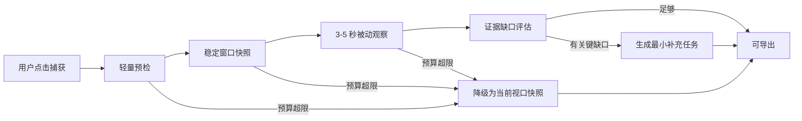

# Design Lens UI、交互与 Smart Capture 产品评审

> 评审日期：2026-07-15
> 评审范围：弹窗、页面录制控制、Reference / Rebuild 主流程、自动采集能力、页面性能与外部方案
> 当前结论：先解决录制卡死风险和主流程复杂度，再建设零配置自适应采集；暂不增加 Spector.js 或更多配置项。

> 实施进度：P0 性能安全、P1 Popup 精简、P2 安全自动捕获主链路和 P3 Side Panel 工作区已完成。P2 包含有界 CandidateIndex、BudgetGuard、稳定窗口、短时被动观察、统一取消、自动降级和最多三个补充任务；P3 已落地共享工作区历史、覆盖、路由、要求、AI 设置和导出管理。Worker/Offscreen 压缩迁移保留为独立性能优化项。

## 1. 最终产品决策

Design Lens 的亮点不应该是“录得更久、配置更多”，而应该是：

> 用户点击一次“捕获当前页面”，插件在严格性能预算内自动收集稳定证据；仅当存在会实质影响结果的缺口时，再提供一到三个明确的补充任务。

该能力命名为 **Smart Capture / 智能捕获**。手动录制保留，但从主流程降级为“补充覆盖”，不再要求用户预先理解桌面/移动视口、五类状态、Canvas、CDP 或场景矩阵。

产品结构调整为：

- Popup：任务模式、一个主操作、最近一次结果和状态。
- 页面浮层：采集中状态、停止按钮、必要时的单个引导任务。
- Side Panel：覆盖详情、路由项目、高级范围、历史和导出管理。
- Capture Engine：自动规划、预算控制、降级、恢复和证据编译。

明确禁止：自动点击未知业务按钮、提交表单、触发支付、自动登录、自动遍历未知链接或跨域流程。

## 2. 产品目标与衡量方式

### 2.1 用户目标

- Reference 用户：不学习采集协议，也能得到可用于原创实现的高质量设计证据和 Prompt。
- Rebuild 用户：以尽量少的操作获得可验证的重建草稿，并清楚知道缺失了什么。
- 所有用户：采集不能明显影响目标页面，随时可以停止，失败后页面必须恢复。

### 2.2 北极星指标

- 首次有效捕获完成率：用户安装后无需打开设置即可完成一次可导出的捕获。
- 首次捕获交互数：从打开 Popup 到结果，默认不超过 2 次点击。
- 自动覆盖率：无需手动录制即可满足 Reference 导出的捕获比例。
- 性能保护率：所有压力用例均无页面冻结、无无法恢复的滚动/视口/调试器状态。
- 结果可信度：UI 不把 `missing`、`not-applicable` 或未授权能力显示为“完整”。

## 3. UI 与交互评审

### P0：状态语义自相矛盾

[`entrypoints/popup/RebuildCoverage.tsx`](../entrypoints/popup/RebuildCoverage.tsx) 的概览状态只特殊处理 `missing` 和 `partial`，其余状态都会显示“完整”。因此 Canvas 为 `not-applicable` 时，概览可显示“完整”，明细却显示“未授权采集”。这会让用户无法判断资料包是否真的可验收。

修正原则：状态必须使用完整枚举映射，至少区分 `complete / partial / missing / not-applicable / unauthorized / failed`；`not-applicable` 不能贡献完整率，也不能显示为成功。

### P0：主操作可能被内部滚动隐藏

[`entrypoints/popup/style.css`](../entrypoints/popup/style.css) 将主容器设为最高 600px 并内部滚动。Rebuild 的设置、诊断、路由项目和导出控件共同进入同一滚动容器，关键操作在常见 Popup 高度下可能落在首屏之外。

修正原则：Popup 首屏始终可见模式选择、主操作和停止入口；结果详情不应通过继续堆高 Popup 解决。

### P1：捕获前配置过载

旧版 Popup 在用户还没有看到页面能力前，就要求选择桌面/移动、初始/滚动/hover/focus/open、Canvas 和授权；随后又提供手动录制与组件选择。用户必须理解实现协议，才能完成第一次操作。P1 已将这组常驻设置替换为主操作触发的按需授权。

更好的顺序是：

1. 用户选择 Reference 或 Rebuild。
2. 点击“捕获当前页面”。
3. 引擎自动检测能力并完成安全证据。
4. 仅在结果有关键缺口时显示“补充覆盖”。

授权不能被删除，但应在 Rebuild 首次捕获时用一句明确确认处理；Canvas 资产授权只在检测到 Canvas 且用户要求导出其位图时出现。

### P1：结果页重复诊断，信息层级失焦

[`entrypoints/popup/ResultPanel.tsx`](../entrypoints/popup/ResultPanel.tsx) 同时展示结果摘要、四项信号、覆盖矩阵、路由项目、标签、准备说明、模型状态和多种导出操作。多数信息是在用不同形式重复解释“证据是否够”。

建议压缩为三层：

- 第一层：结果状态，例如“可导出”或“还差 2 个关键状态”。
- 第二层：`导出` 与 `补充覆盖` 两个操作。
- 第三层：覆盖、信号、模型、路由等详情进入 Side Panel。

### P1：高级项目能力过早出现

[`entrypoints/popup/RebuildRouteProjectPanel.tsx`](../entrypoints/popup/RebuildRouteProjectPanel.tsx) 对所有 Rebuild 结果展示多路由项目。单页/单组件用户被迫理解网站项目概念，增加了产品噪声。

路由项目应由用户在 Side Panel 中显式创建，或在第二次捕获同源路由时给出非阻塞建议。

### P1：AI 设置与任务模式耦合不清

Rebuild 草稿不依赖 AI，但全局头部仍保留 AI Key 入口。Reference 用户也必须先理解“证据包”和“AI Prompt 包”的区别，才能选择导出。

建议：

- Reference 第一次导出时，若无 Key，默认导出基础包并提供“连接 AI 生成 Prompt”。
- Rebuild 隐藏 AI 设置；需要 AI 编译时在导出流程中按需出现。
- 设置入口移到 Side Panel 或更多菜单，不能与主操作同等强调。

### P2：文案暴露内部协议

`CDP`、`Canvas`、`motion frames`、`artifact`、`scene manifest` 等适合诊断和文档，不适合主界面。面向用户应改为“深度页面证据”“动态画面”“动画关键帧”“原始资料”“覆盖场景”。

### P2：视觉噪声高于操作价值

当前 Popup 使用多层渐变、网格纹理、较大的品牌区、较多圆角容器和强调色。单独看具有识别度，但在 380px 工具界面中会挤压有效信息，并弱化主次关系。

建议保留酸绿色品牌色作为主操作/状态强调，移除背景光斑和重复装饰线；卡片半径控制在 6-8px，品牌区压缩到 40-48px 高，结果使用列表和分隔线而不是继续嵌套卡片。复杂动画不需要 GSAP。

## 4. 推荐的极简流程

```text
空闲
┌──────────────────────────────┐
│ Design Lens          ···     │
│ [设计参考 | 高保真重建]       │
│                              │
│  [ 捕获当前页面 ]             │
│                              │
│ 最近：cappen.com · 可导出      │
└──────────────────────────────┘

自动捕获中
┌──────────────────────────────┐
│ 正在收集当前页面              │
│ 结构与视觉       已完成        │
│ 动态状态          观察中       │
│                              │
│  [ 停止 ]                     │
└──────────────────────────────┘

结果
┌──────────────────────────────┐
│ 已捕获，可导出                │
│ 8 个组件 · 3 个状态 · 2 个缺口 │
│                              │
│ [ 导出 ]   [ 补充覆盖 ]        │
│ 查看详情 →                    │
└──────────────────────────────┘

补充覆盖
┌──────────────────────────────┐
│ 还缺少移动菜单展开状态         │
│ 请打开菜单，插件只观察此操作    │
│                              │
│ [ 开始补充 ]  [ 暂时跳过 ]      │
└──────────────────────────────┘
```

Popup 不显示五个状态复选框。Side Panel 才展示完整场景矩阵、每个缺口的原因和高级重采集入口。

## 5. 插件能力评审

### 5.1 当前优势

- Reference / Rebuild 已有明确数据和导出边界。
- CaptureProject v2、artifact store、二进制 ZIP 为复杂证据提供了基础。
- rrweb、CDP、截图、动画关键帧、Canvas 与多路由证据已经形成完整能力链。
- Playwright + pixelmatch 验收让 Rebuild 不只是生成更长 Prompt，而是具备可测量结果。
- 调试器、视口、滚动和伪状态已有恢复测试，工程基础比普通 Prompt 插件更完整。

### 5.2 当前核心问题

- 能力是按技术模块逐层暴露给用户的，而不是按用户任务自动编排。
- “捕获更多”主要依赖延长手动录制，结果质量依赖用户是否知道该滚动、悬停或打开什么。
- Reference 与 Rebuild 共用较重的时间线扫描方式，轻量任务承担了不必要成本。
- 当前覆盖报告能描述缺口，但还不能把缺口自动转成最小补充任务。
- 多路由、Canvas 和深度采集都已进入 Popup，产品复杂度增长快于用户价值。

### 5.3 能力分层

| 层级 | 默认行为 | 用户是否配置 | 说明 |
| --- | --- | --- | --- |
| Snapshot | 当前视口截图、语义结构、Token、候选组件 | 否 | 每次捕获的安全基线 |
| Passive Timespan | 3-5 秒短时观察滚动、焦点、动画和 DOM 变化 | 否 | 不主动操作页面 |
| Adaptive Deep Evidence | 单次 DOMSnapshot、匹配样式、有限多视口与关键帧 | Rebuild 自动启用 | 受预算和权限限制 |
| Guided Gap Filling | 引导用户完成一个缺失状态 | 可选 | 手动录制的新定位 |
| Imported Flow | 导入 DevTools Recorder 用户流程 | 高级、后续 | 不要求普通用户使用 DevTools |

## 6. 页面卡死风险评审

当前实现存在可信的卡死风险，不应继续在其上增加更多自动扫描：

1. [`src/overlay/page-overlay.ts`](../src/overlay/page-overlay.ts) 录制期间每 1.2 秒调用一次完整 `scanPage()`。
2. 同一文件还在 `scroll`、`pointerup` 和高频 `mouseover` 上触发扫描。
3. [`src/analyzer/capture/capture-page.ts`](../src/analyzer/capture/capture-page.ts) 每次遍历可见 DOM、筛选语义节点、按面积排序，并对最多 260 个元素读取 computed style。
4. [`src/analyzer/timeline/interaction-timeline.ts`](../src/analyzer/timeline/interaction-timeline.ts) 每 260ms 采样一次页面帧，滚动事件又会立即追加采样。
5. 每帧还会读取候选元素、几何、样式、Web Animations 和 Canvas/video/img/svg 表面。
6. 全文档 MutationObserver 监听 `class/style/data-state/aria` 和子树变化，但没有 mutation storm 熔断。
7. 停止录制前后还会执行多次 burst scan。
8. [`src/capture-v2/browser/scene-screenshot-collector.ts`](../src/capture-v2/browser/scene-screenshot-collector.ts) 长页面默认可能采集 24 个滚动段，每段等待 600ms。
9. rrweb 只有 2500 事件总量上限，没有针对单次突变批次和持续突变速率的停止策略。

在大 DOM、复杂 SVG、JS 动画、Canvas、虚拟列表或持续修改 class/style 的页面上，这些链路会叠加占用主线程。事件数组有长度上限不代表采集过程有 CPU 上限。

## 7. Smart Capture 技术方案

### 7.1 采集阶段



轻量预检只检测能力和规模，不读取所有 computed style。稳定窗口使用有界 MutationObserver 等待短暂安静期，达到超时后直接继续，不能无限等待。

Snapshot 只进行一次候选索引和一次结构采集；样式读取仅面向候选节点。Passive Timespan 只记录低成本事件，不在事件回调里重新扫描页面。

### 7.2 引擎模块

- `SmartCaptureOrchestrator`：阶段状态机、总超时和恢复。
- `CaptureBudgetGuard`：记录单片耗时、long task、mutation 速率和内存/事件量，决定继续、降级或停止。
- `CandidateIndex`：初次分块建立候选节点，MutationObserver 只做有限失效标记。
- `PassiveSignalRecorder`：滚动、指针、焦点和动画信号的统一 rAF 节流。
- `CoveragePlanner`：将证据缺口转成用户可理解的补充任务。
- `ArtifactWorker`：分析、压缩、去重和 ZIP 移到 Worker 或 Offscreen Document。

### 7.3 不允许的实现

- 不在 `mouseover`、`pointermove` 或原始 `scroll` 回调中执行全页扫描。
- 不使用多个独立定时器重复读取相同 DOM 和样式。
- 不因“自动化”主动点击业务控件或遍历导航。
- 不默认开启 Canvas/WebGL frame 录制。
- 不在页面主线程同步执行大 JSON 序列化、压缩、图片 diff 或 ZIP。

## 8. 强制性能预算与熔断

| 项目 | 默认预算 | 超限行为 |
| --- | --- | --- |
| 单个协作式分析片段 | 6-8ms | 让出主线程，下一帧或 idle 继续 |
| 扩展引入的长任务 | 不允许超过 50ms | 记录并立即降低采样 |
| 单次极端长任务 | 200ms | 停止重型分析，只保留快照 |
| 被动观察时间 | 3-5 秒 | 自动结束，不等待用户 |
| Smart Capture 总时长 | 15 秒 | 超时导出已有证据并列出缺口 |
| DOM 安静窗口 | 300ms，最多等待 1500ms | 到时继续，不无限等待 |
| Mutation 提示阈值 | 750 | 标记高动态页面并降低采样 |
| Mutation 硬上限 | 10,000 | 停止增量录制，保留已采证据 |
| Mutation storm | 连续 2 秒超过 500 次/秒 | 断开 observer，降级快照 |
| 默认长页截图 | 3-5 个语义锚点 | 24 段完整采集改为高级选项 |
| 页面隐藏 | `document.hidden === true` | 暂停采样与计时器 |
| 停止响应 | 250ms 内停止新增采样 | 后台异步整理已有证据 |

所有阶段必须共享一个 `AbortController`。任何失败、超时、tab 隐藏、用户停止或 debugger detach 都必须进入同一恢复路径，恢复滚动、视口、滚动行为、伪状态、动画时间、页面遮罩和 debugger 会话。

## 9. 外部方案与可复用结论

调研使用 agent-reach 的 GitHub `gh CLI` 后端，并以官方仓库内容为准。

| 参考 | 可复用结论 | 本项目决策 |
| --- | --- | --- |
| [Chrome Side Panel samples](https://github.com/GoogleChrome/chrome-extensions-samples/tree/main/functional-samples/cookbook.sidepanel-open) | 支持从用户操作打开 tab 专属持久面板 | 高级流程迁移到 Side Panel |
| [ProjectVisBug](https://github.com/GoogleChromeLabs/ProjectVisBug) | 页面工具一次激活一个能力，浮层紧凑 | 页面只显示当前任务和停止入口 |
| [rrweb storage optimization](https://github.com/rrweb-io/rrweb/blob/master/docs/recipes/optimize-storage.md) | 官方建议屏蔽高噪声 DOM、事件采样、压缩和去重；长列表、复杂 SVG、JS 动画、Canvas 是高量场景 | 默认采样、动态降级、Worker 压缩，不追求全量事件 |
| [Sentry Replay](https://github.com/getsentry/sentry-javascript/blob/develop/packages/replay-internal/src/integration.ts) | 默认 `mutationBreadcrumbLimit: 750`、`mutationLimit: 10_000`，媒体默认屏蔽 | 引入 mutation 软/硬阈值和停止策略 |
| [Lighthouse User Flows](https://github.com/GoogleChrome/lighthouse/blob/main/docs/user-flows.md) | Navigation / Timespan / Snapshot 分层，Timespan 应短且聚焦 | 采用 Snapshot + 短被动 Timespan + 可选补充任务 |
| [Chrome DevTools Recorder API](https://github.com/chromium/chromium/blob/main/chrome/common/extensions/api/devtools/recorder.json) | 可 stringify 单步/完整录制，并支持自定义 replay；数据使用 Puppeteer recording schema | 后续支持导入现成流程，不要求普通用户录制 |
| [Puppeteer Replay](https://github.com/puppeteer/replay) | 可回放和转换 DevTools Recorder 用户流程 | P4 高级能力，当前不增加依赖 |

不建议当前引入 Spector.js。WebGL frame 采集价值高但开销和侵入性也高，应作为检测到 WebGL 后的显式高级模块，并且必须单独建立性能与隐私预算。

## 10. 分阶段实施路线

### P0：先消除卡死风险

- 删除 `mouseover` 触发的全页扫描。
- scroll/pointer 信号统一进入单个 rAF 节流器。
- 取消 260ms frame 全量采样和 1.2s 全页扫描叠加。
- 为 MutationObserver、rrweb、截图、CDP 增加预算、超时、熔断与统一恢复。
- 默认长页截图降为语义锚点，24 段改为高级模式。
- 添加大 DOM、mutation storm、复杂 SVG、Canvas、持续动画压力测试。

### P1：简化 Popup

- 首屏仅保留模式分段、`捕获当前页面`、最近结果和设置菜单。
- 结果页只保留状态、`导出`、`补充覆盖` 和 `查看详情`。
- 修正 coverage 状态语义。
- Rebuild 授权改为首次动作确认；Canvas 授权按检测结果出现。

### P2：建设 Smart Capture

- 落地 Orchestrator、BudgetGuard、CandidateIndex 和 PassiveSignalRecorder。
- 自动生成证据缺口和最多三个补充任务。
- Reference 默认不需要人工录制；Rebuild 默认自动收集安全深度证据。
- 分析、压缩和 ZIP 迁移到 Worker/Offscreen Document。

### P3：Side Panel 工作区

- 承载覆盖矩阵、路由项目、历史、设置、诊断和导出管理。
- Popup 与 Side Panel 共享捕获状态，不重复维护业务逻辑。
- 支持从页面浮层和 Popup 一键打开当前任务详情。

完成情况：

- 标准构建已声明 `sidePanel` 权限和 `sidepanel.html`，Popup 可直接打开概览或设置。
- 最近 8 次完整结构化捕获存入 IndexedDB；截图、rrweb、CDP 等二进制 artifact 只保留引用，不复制进 `storage.local`。
- 当前标签页、历史选择和路由编辑权限分离；只有当前标签页最新结果可更新路由项目。
- Side Panel 首次向普通网页发起捕获或选取时自动注入内容脚本，不要求用户先打开 Popup。
- 320x700、360x800 和 768x900 已覆盖空状态、参照结果、重建覆盖、历史、参照/重建设置和录制停止状态；无横向溢出或控制台错误。
- Popup 340x600 已复核为模式、智能捕获、组件选取、快速导出、补充覆盖和工作区入口，不再重复显示诊断详情。

### P4：高级流程导入

- 支持 Chrome DevTools Recorder / Puppeteer schema 导入，并复用 `@puppeteer/replay` 官方 parser 做输入校验。
- 将已录制流程编译为 Rebuild 场景计划，而不是再要求用户重复录制；导入场景保持 `planned`，没有截图证据就不能进入验收。
- 输入上限为 2MB/500 步/120 个场景；`change` 值、表达式、自定义参数、关闭和无效导航全部不持久化。
- 工作区只展示导入统计、脱敏/忽略警告和替换/移除操作，不增加自动回放按钮。
- Spector.js/WebGL 仅在独立性能验证通过后作为可选模块评估。

完成情况：

- Rebuild 覆盖页已加入 Recorder JSON 导入入口，支持单页结果和同源路由项目。
- 工作区历史记录保留导入计划；Smart Capture 更新同一捕获时不会丢失导入流程。
- Rebuild ZIP 在存在导入流程时增加 `imported-recorder-flow.json`，并在 `scene-manifest.json` 中明确标记导入场景仍待采集。
- 360px 浏览器验收覆盖导入后统计、三类警告、无横向溢出和零控制台错误。

### P5：Recorder 证据对齐

- 导入场景按 URL path、视口尺寸、触发类型、滚动位置和 selector 与已有 Rebuild screenshot scene 对齐。
- 同视口同触发且存在截图时标记 `matched`；只有交互或 selector 线索时标记 `partial`；其余保持 `missing`。
- 工作区显示已匹配、部分和缺口数量，不增加自动回放或批量补录配置。
- Rebuild ZIP 增加 `imported-recorder-flow-match.json`，`scene-manifest.json` 只把 `matched` 场景计为 captured。
- 360px 浏览器验收结果为 3 matched / 1 partial / 1 missing，无横向溢出和控制台错误。

### P6：Recorder 缺口任务

- `matched` 场景不生成任务；`missing` 截图缺口为高优先级，`partial` 交互线索为中优先级。
- 任务按目标视口、触发类型和规范化 selector 归并，相同缺口合并来源场景，桌面端与移动端保持独立。
- 初始视口、scroll、hover 和 open 分别映射到现有响应式或状态补采；缺少可用 selector 时降级到引导采集或组件选取，不猜测目标。
- Recorder 任务与 Smart Capture 任务合并后仍限制为最多三个；概览只提供一个上下文补采命令，不增加逐场景控件。
- 规划器只生成建议，不自动 replay、click、input 或 navigate，也不会把任务当作已获取证据。

### P7：Recorder 补采闭环

- Recorder flow 导入和每次工作区捕获写入时在后台原子重算 match，Side Panel 不再承担异步写回，避免短暂显示旧任务。
- 同一标签页、同一路由、同为 Rebuild 的后续捕获继承当前 Recorder flow；不同路由或 Reference 捕获不会误继承。
- selector 丢失时，概览主操作先进入带场景上下文的目标定位；用户确认的 selector 写回场景计划，但不会把组件选取结果伪装成截图证据。
- 目标定位后任务从“需定位”切换为对应状态补采；后续真实截图匹配成功后任务自动消失。
- 覆盖页用一行状态解释目标定位、视口基线和状态截图三类阻塞原因；全部匹配时显示证据已闭环，不增加高级配置。

### P8：任务感知的引导采集

- Side Panel 每次只把最高优先级的一项任务传给页面浮层；普通补充覆盖仍保留原手动录制方式。
- Rebuild 任务由用户点击主操作后直接开始，无需在浮层再点一次开始；浮层只显示当前动作和停止按钮。
- hover、focus、scroll、click/open、wait 和响应式基线使用单目标监听与稳定窗口判断，满足后只截当前视口一次并自动停止。
- 用户真实 hover/focus 分别写为 `observed-hover` / `observed-focus`，与 Collector 的 `forced-hover` / `forced-focus` 明确区分；两者都可作为对应状态的截图证据。
- 任务录制跳过起点截图、整页分段基线和深采集，只保留轻量时间线、可选 rrweb 与定向截图；20 秒未观察到目标状态则安全停止且任务保持未完成。
- 具体 Recorder 任务不会显示 selector 或内部场景 ID，不自动派发 DOM 事件，也不替用户点击、输入或导航。

## 11. 发布验收门槛

### 易用性

- 新用户不进入设置即可完成 Reference 捕获和基础导出。
- 默认主流程不超过 2 次点击。
- Popup 380x600 内主操作和停止入口始终可见，无横向滚动。
- 键盘可完成模式切换、捕获、停止、导出和查看详情。
- UI 中不存在相互矛盾的覆盖状态。

### 性能与恢复

- 在 10k、50k、100k DOM 节点压力页上均可停止，页面保持可交互。
- mutation storm、无限动画、复杂 SVG、Canvas 和长页面用例不会出现不可恢复冻结。
- 捕获引入的任何单次任务不得超过 200ms；发现 50ms 长任务后必须自动降级。
- 用户点击停止后 250ms 内不再新增采样事件。
- 正常、失败、超时和用户取消路径全部恢复滚动、视口、动画、伪状态、遮罩和 debugger。
- 隐藏 tab 不继续执行采样和截图循环。

### 产品边界

- 不自动提交、支付、登录、删除或导航未知链接。
- 未授权 Canvas、跨域 iframe、闭合 Shadow DOM 和 DRM 媒体明确显示为缺口。
- Draft 与可验收结果命名不同；缺失证据不会由 AI 猜测补全。

## 12. 本轮建议的执行边界

立即执行 P0 和 P1，不继续扩展采集类型。P0 通过压力测试后再进入 Smart Capture P2；Side Panel 与 Recorder 导入分别属于 P3/P4。这个顺序能先解决真实风险，再让自动化成为稳定的产品亮点，而不是将现有手动录制逻辑在后台更高频地运行。
